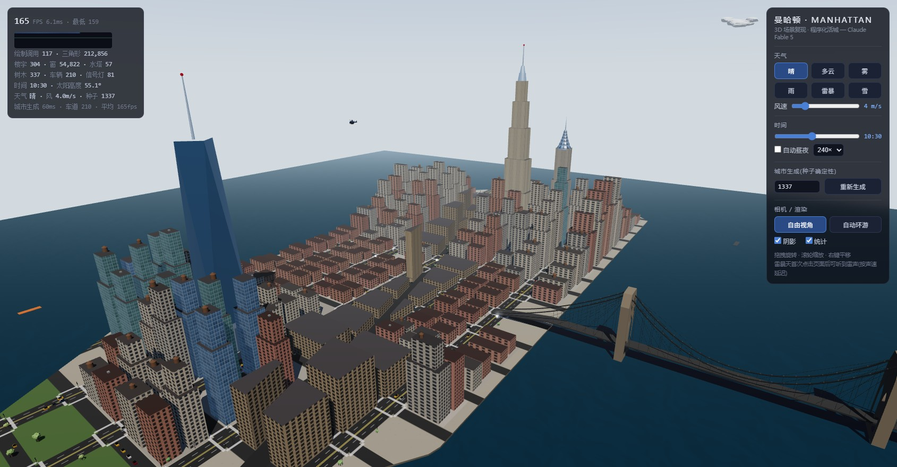
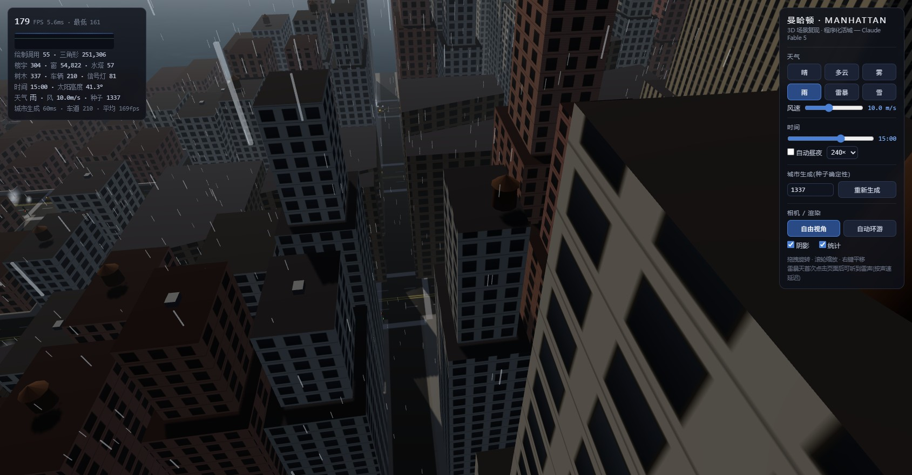
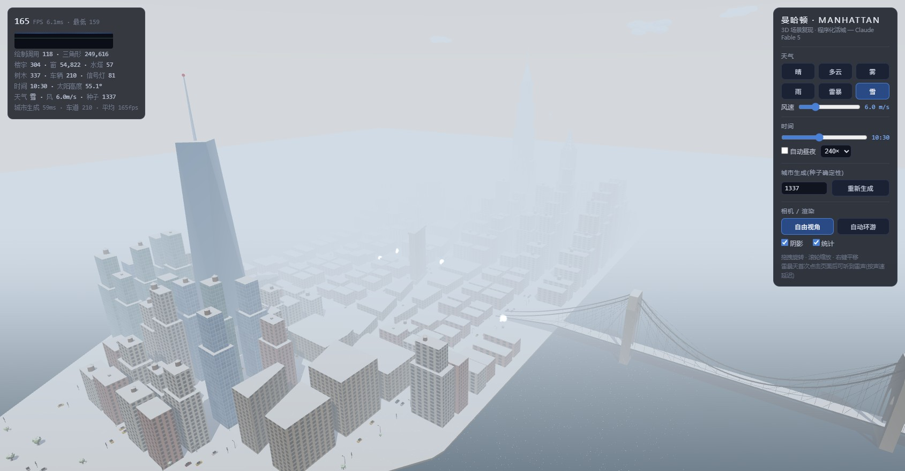
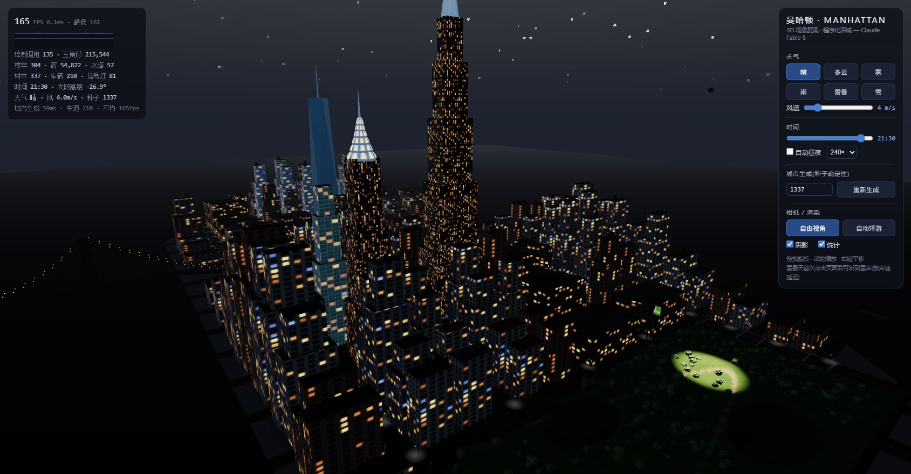

# 3D 曼哈顿场景复现 — 程序化活城

**Claude Fable 5 · mission `manhattan` · variant `procedural` · 端口 3025**

对照冻结规范 [`benchmark/tasks/code-to-3d/manhattan.md`](../benchmark/tasks/code-to-3d/manhattan.md) 的参考实现:单一场景同时覆盖**建模 / 3D 雕刻 / 动画 / 天气 / 计算**五项能力,全程序化零外部资产(所有几何、贴图、音效均由代码生成)。



## 运行

```bash
npm run dev      # http://127.0.0.1:3025
npm test         # 20 个单元测试(确定性/太阳公式/悬链线/规划裁剪)
```

或在仓库根目录 `npm run dev:one -- 3025`。

## 五能力对照

### ① 建模(结构化)
- 曼哈顿路网:5 条南北大道 × 21 条东西街道,**百老汇斜切**产生三角地块(Sutherland–Hodgman 半平面裁剪)
- 四座手工地标:**帝国大厦**(五级退台 + 冠顶尖塔 + 闪烁航空灯)、**克莱斯勒**(六层叠拱冠顶 + 旭日纹三角窗)、**世贸一号**(方转 45° 渐变收分八面体)、**熨斗大厦**(楔形地块挤出 + 基座带/檐口)
- 城市肌理:5 套画布立面(石灰岩/灰石/砖/双色玻璃幕墙)实例化楼群、屋顶**水塔**与空调箱、路灯、红绿灯、斑马线车道线
- **布鲁克林大桥**:哥特双尖拱石塔、悬链线主缆、吊索 + 斜拉索网、夜间项链灯、对岸剪影街区

### ② 3D 雕刻(有机形体)
- **中央公园地形**:fBm 丘陵 + 两处下凹水塘 + 蜿蜒步道,顶点着色(草地/泥土/步道),边缘与街面平滑衔接
- **曼哈顿片岩露头**:三重噪声位移雕刻 25 处,合批为单次绘制
- **自由女神**:车削长袍轮廓 + 周期噪声**衣褶雕刻**(大褶/细褶两频段,幅度随高度衰减),冠冕七芒、火炬(夜间自发光)、法典、十一角星要塞基座
- **体积云**:位移二十面体聚簇,随风漂移;树冠同样为噪声位移几何

### ③ 动画
- **昼夜循环**:太阳/月亮/程序化星空运转,窗灯・路灯・桥灯・泛光灯黄昏自动亮起(可 60×/240×/720× 加速)
- **交通流**:210 辆车沿有向车道图行驶,红灯停绿灯行,路口转向,刹车灯点亮,夜间大灯光池
- 非车辆动画体:**两群拍翅鸟**(利萨茹领航)、**巡航直升机**(旋翼/压弯/夜间扫掠探照灯)、**三艘船**(渡轮/驳船/拖船,浪涌起伏)
- 环境动画:时代广场**动画广告牌**(滚动字/色浪/假行情)、井盖蒸汽、云漂移
- 相机:自由轨道 + **自动环游**(CatmullRom 样条掠城)

### ④ 天气
- 六预设:**晴 / 多云 / 雾 / 雨 / 雷暴 / 雪**,全参数指数平滑过渡
- 场景响应:雨天**路面变湿变亮**(粗糙度/明度联动);雪天**按朝上法线积雪**(全城材质共享 shader 补丁,屋顶/地面/桥面/岩石/树冠变白);雾天高楼没顶;雷暴铅灰压顶
- **闪电优先击中最高地标尖顶**,雷声 WebAudio 布朗噪声合成,按 **340m/s 声速**延迟到达
- 风驱动:雨雪倾角、云速、树冠摇曳(顶点 shader)、水面波纹强度

### ⑤ 计算
- **种子确定性**:mulberry32 + fork 子流,同种子逐字节同城市(UI 可输种子重建;单测验证)
- 真实公式 ×3:**太阳高度角/方位角**(纬度 40.74°N 时角公式)、**悬链线**(牛顿迭代解 a·(cosh(L/a)−1)=s)、**双峰天际线高度场**(中城/下城高斯混合,对应真实基岩分布)
- **交通仿真**:26s 信号周期沿大道绿波偏移、跟车防撞、停车线制动
- 性能:InstancedMesh 全覆盖(楼宇/树/车/雨雪/灯具/吊索),桌面 1080p 实测 **~165fps,约 110 draw call**,统计 HUD 实时展示 FPS/三角形/实例数

## 操作

右侧面板:天气 6 键 · 风速 · 时间滑杆(自动昼夜 + 倍速) · 种子重建 · 自由/环游相机 · 阴影/统计开关。雷暴天首次点击页面后可听到雷声。控制台调试钩子:`__manhattan.strike()` 强制闪电、`__manhattan.stats()` 查看生成统计。

## 画面存档

| | | |
|---|---|---|
|  |  |  |

技术栈:Three.js 0.184 · Vite 8 · 原生 JavaScript · Vitest 3(20 tests)
